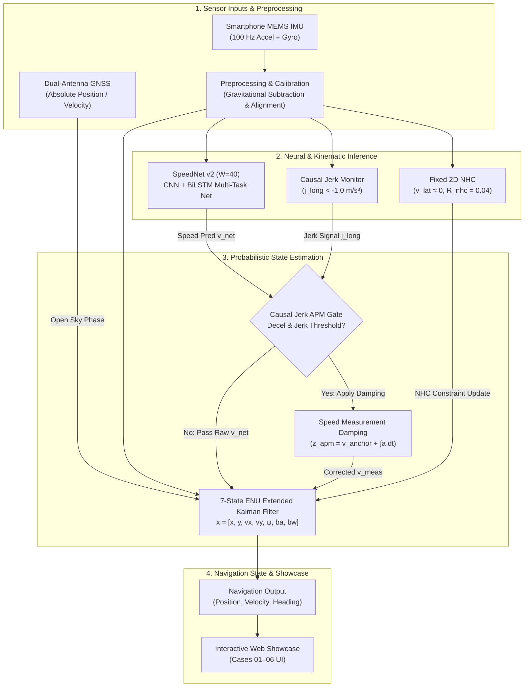

# AI-ML Intelligent Dead Reckoning for Seamless Navigation

**Smart India Hackathon (SIH) 2026** | **Problem Statement 26168** | **ISRO / Department of Space**

An AI-assisted smartphone inertial dead-reckoning prototype with GNSS transition handling and kinematic constraints, validated on the Indian Open Vehicle Navigation Benchmark Dataset (IO-VNBD) with a demonstrated short-duration operating envelope and identified long-duration drift limitations.

---

### Component & System Status Overview

| Component / Metric | Production Specification / Measured Result | Scientific Status |
|---|---|---|
| **Primary Dataset** | IO-VNBD (Vehicle Telemetry, 100 Hz Smartphone IMU + Dual-Antenna GNSS) | **VALIDATED** |
| **Speed Engine** | SpeedNet v2 (Window $W=40$, 1D-CNN + BiLSTM Multi-Task Neural Network) | **VALIDATED** |
| **Inertial Sensors** | Low-Cost Smartphone MEMS Accelerometer & Gyroscope | **VALIDATED** |
| **Estimator Core** | 7-State ENU Extended Kalman Filter (EKF) | **VALIDATED** |
| **Kinematic Constraint** | Fixed 2D Non-Holonomic Constraint ($v_{\text{lat}} \approx 0, R_{\text{nhc}} = 0.04$) | **VALIDATED** |
| **Motion Correction** | Causal IMU Jerk-Gated APM ($j_{\text{long}} < -1.0\text{ m/s}^3, \delta v = 0.50\text{ m/s}$) | **VALIDATED (M028)** |
| **Interactive Showcase** | Scenario-Based Web Prototype (Cases 01–06: Forest, Tunnel, Canyon, etc.) | **SIMULATED** |
| **60-Second Outage Benchmark** | **27.35 meters** | **PASS** (SIH Target: $< 50.00\text{ m}$) |
| **120-Second Outage Benchmark** | **426.85 meters** | **FAIL** (Drift accumulation identified) |
| **300-Second Outage Benchmark** | **218.93 meters** | **FAIL** (Drift accumulation identified) |
| **1-Kilometer Outage Benchmark** | **307.46 meters** | **FAIL** (Long-duration limitation identified) |
| **Long-Duration Drift Limitation** | Heading unobservability under unanchored gyro integration | **IDENTIFIED & DOCUMENTED** |

---

## 1. The Problem — Why This System Exists

### GNSS Vulnerability in Real-World Environments
Global Navigation Satellite Systems (GNSS / GPS / NavIC) provide accurate absolute position fixes under open-sky conditions. However, land vehicles frequently traverse environments where satellite signals are severely degraded or completely blocked:

- **Underground Tunnels & Underpasses**: Physical signal blockage (total GNSS denial).
- **Dense Forested Highways**: Heavy canopy absorption and multipath scattering.
- **Deep Urban Canyons**: High-rise building blockage and false reflections.
- **Mountain Valleys**: Topographic shadowing blocking satellite line-of-sight.
- **GNSS Interference & Jamming**: Radio frequency interference disrupting receiver locks.

During a GNSS outage, position updates cease. A navigation system cannot simply freeze the vehicle's position on a map, as the vehicle continues moving at speed. Without absolute corrections, position must be estimated by integrating onboard sensor readings—a process known as **Dead Reckoning**.

### The Smartphone MEMS IMU Challenge
Consumer smartphones contain micro-electro-mechanical systems (MEMS) Inertial Measurement Units (IMUs). Unlike tactical or navigation-grade IMUs costing tens of thousands of dollars, smartphone MEMS sensors exhibit high noise, thermal instability, time-varying bias drifts, and scale factor errors:

1. **Double Integration of Accelerometer Noise**: Integrating accelerometer signals twice to obtain position ($x = \iint a \, dt^2$) causes position error to grow quadratically ($\mathcal{O}(t^2)$) or cubically with bias errors. Uncorrected accelerometer noise causes position estimates to explode within seconds.
2. **Gyroscope Bias & Heading Drift**: Gyroscope bias errors cause heading error $\delta \psi$ to grow linearly ($\delta \psi \approx b_\omega t$). Because forward velocity is projected into local coordinates using heading ($v_x = v \cos \psi, v_y = v \sin \psi$), a small heading error creates an unobservable orthogonal position drift that grows quadratically with time ($\mathcal{O}(t^2)$).

---

## 2. The Key Idea — Hybrid Multi-Tier Architecture

To overcome the exponential drift of standalone MEMS integration without relying on external hardware, our system adopts a **hybrid multi-tier navigation architecture**:

$$\text{Physical Sensors} + \text{Neural Inference} + \text{Kinematic Constraints} + \text{Probabilistic EKF} + \text{Causal Jerk Gating}$$

```
                               ┌───────────────────────────────────────────────┐
                               │           HYBRID MULTI-TIER SYSTEM            │
                               └───────────────────────┬───────────────────────┘
                                                       │
         ┌────────────────────────┬────────────────────┼────────────────────┬────────────────────────┐
         ▼                        ▼                    ▼                    ▼                        ▼
┌─────────────────┐    ┌────────────────────┐    ┌───────────┐    ┌──────────────────┐    ┌────────────────────┐
│ Smartphone IMU  │    │    SpeedNet v2     │    │ Fixed NHC │    │ Jerk-Gated APM   │    │ 7-State ENU EKF    │
│  (Accelerometer │    │ (CNN+BiLSTM Speed  │    │ (Kinematic│    │  (IMU Decel Damp │    │ (Probabilistic     │
│   + Gyroscope)  │    │    Inference)      │    │ Damping)  │    │   Correction)    │    │  Sensor Fusion)    │
└─────────────────┘    └────────────────────┘    └───────────┘    └──────────────────┘    └────────────────────┘
```

### Why Each Component is Necessary:
- **IMU Alone Drifts**: Integrating raw acceleration explodes position error within seconds.
- **ML Alone Lacks Kinematic Bounds**: Pure end-to-end neural networks cannot guarantee physical state continuity, energy conservation, or zero-velocity stops.
- **EKF Alone Cannot Regress Speed**: Standard EKFs require velocity measurements; integrating noisy accelerometers in an EKF leads to severe bias divergence.
- **Kinematic Constraints (NHC) Restrain Lateral Motion**: Land vehicles roll along their longitudinal axis without sliding sideways ($v_{\text{lat}} \approx 0$).
- **Causal Jerk Gating Prevents Overshoot**: Neural networks lag during hard deceleration. Gating updates via longitudinal IMU jerk ($j_{\text{long}}$) eliminates velocity over-estimation during braking.

---

## 3. High-Level System Architecture



---

## 4. Component-by-Component Technical Breakdown

### 4.1. Preprocessing & Sensor Alignment
Raw accelerometer signals contain gravitational contamination. Preprocessing separates gravity vectors $\mathbf{g}$ from linear vehicle body acceleration $\mathbf{a}_{\text{body}}$:

$$a_{\text{long}} = -(a_{y,\text{raw}} - g_y), \quad a_{\text{lat}} = a_{x,\text{raw}} - g_x$$

Longitudinal jerk $j_{\text{long}}$ is calculated causally from sequential acceleration samples ($\Delta t = 0.1\text{s}$ at 10 Hz):

$$j_{\text{long}}[k] = \frac{a_{\text{long}}[k] - a_{\text{long}}[k-1]}{\Delta t}$$

### 4.2. SpeedNet v2 (Multi-Task CNN + BiLSTM Neural Speed Engine)
SpeedNet v2 is a temporal multi-task neural network trained on normalized 6-axis IMU sliding windows ($W=40$ samples = 4 seconds of temporal context at 10 Hz):

- **Feature Extractor**: 2-layer 1D CNN (32 $\to$ 64 filters) extracting short-term temporal dynamics.
- **Context Recurrent Layer**: Single-layer Bidirectional LSTM (hidden dimension 64) modeling long-range temporal trends.
- **Multi-Task Heads**:
  1. Forward Speed Regression Head ($v_{\text{net}} \ge 0\text{ m/s}$, ReLU activated).
  2. Vehicle Yaw Rate Regression Head ($\omega_{\text{yaw}}$ in $\text{rad/s}$).
  3. Stationary Classification Head ($P(\text{stat}) \in [0, 1]$, Sigmoid logit output).
  4. Auxiliary Velocity Change Head ($\Delta v$).

### 4.3. 7-State ENU Extended Kalman Filter (EKF)
The filter estimates 7 kinematic navigation states in local East-North-Up (ENU) coordinates:

$$\mathbf{x} = \begin{bmatrix} x & y & v_x & v_y & \psi & b_a & b_\omega \end{bmatrix}^T$$

Where $(x, y)$ are local positions, $(v_x, v_y)$ are ENU velocity components, $\psi$ is vehicle heading, $b_a$ is accelerometer bias, and $b_\omega$ is gyroscope bias.

#### Time Update (Prediction):
$$\psi[k] = \psi[k-1] + (\omega_z - b_\omega) \Delta t$$
$$\mathbf{v}[k] = \mathbf{v}[k-1] + \mathbf{R}_b^n (\mathbf{a}_{\text{imu}} - b_a) \Delta t$$
$$\mathbf{p}[k] = \mathbf{p}[k-1] + \mathbf{v}[k] \Delta t$$

### 4.4. Fixed Non-Holonomic Constraint (NHC)
Wheeled land vehicles obey physical motion constraints: under non-slipping conditions, velocity perpendicular to the drive direction is zero ($v_{\text{lat}} \approx 0$).

The lateral velocity in the local navigation frame is:
$$v_{\text{lat}} = v_x \cos \psi - v_y \sin \psi \approx 0$$

An NHC measurement update is applied at every timestep with observation matrix $\mathbf{H}_{\text{nhc}}$ and measurement variance $R_{\text{nhc}} = 0.04\text{ m}^2/\text{s}^2$, constraining sideways position drift explosion.

### 4.5. Causal IMU Jerk-Gated APM (M028 Canonical Mechanism)
Neural speed regressors suffer from temporal smoothing during sudden braking, causing the network to over-estimate speed during deceleration. The **Adaptive Position/Velocity Correction Mechanism (APM)** detects braking via IMU jerk:

$$\text{Condition: } a_{\text{long}}[k] < -0.5\text{ m/s}^2 \quad \text{AND} \quad |\omega_z[k]| \le 3.0^\circ/\text{s} \quad \text{AND} \quad j_{\text{long}}[k] < -1.0\text{ m/s}^3$$

When activated, an IMU-integrated speed anchor $z_{\text{apm}}$ is computed over a 5-sample window:
$$z_{\text{apm}} = \max\left(0, v_{\text{est}}[k-5] + \sum_{i=k-4}^{k} a_{\text{long}}[i] \Delta t\right)$$

If SpeedNet over-estimates speed ($v_{\text{net}} > z_{\text{apm}}$), a bounded correction $\delta v = \min(v_{\text{net}} - z_{\text{apm}}, 0.50\text{ m/s})$ is subtracted, updating the EKF measurement with $v_{\text{meas}} = v_{\text{net}} - \delta v$.

### 4.6. Stationary Detection & Zero-Velocity Updates (ZUPT)
When SpeedNet predicts $P(\text{stat}) > 0.70$, the vehicle is classified as stationary. The system applies a Zero-Velocity Update (ZUPT):

$$\mathbf{z}_{\text{zupt}} = \begin{bmatrix} 0 & 0 \end{bmatrix}^T, \quad \mathbf{H}_{\text{zupt}} = \begin{bmatrix} 0 & 0 & 1 & 0 & 0 & 0 & 0 \\ 0 & 0 & 0 & 1 & 0 & 0 & 0 \end{bmatrix}$$

This resets accumulated velocity errors to zero during traffic stops or red lights, preventing stationary drift accumulation.

### 4.7. GNSS Transition & Recovery Handling
- **GNSS Available (Open Sky)**: The EKF executes full 5D updates ($\mathbf{z} = [x_{\text{gt}}, y_{\text{gt}}, v_{x,\text{gt}}, v_{y,\text{gt}}, \psi_{\text{gt}}]^T$), estimating sensor biases ($b_a, b_\omega$) and initializing state covariances.
- **GNSS Outage Triggered**: Absolute GNSS updates cease instantly. The filter switches seamlessly to autonomous dead reckoning, fusing SpeedNet v2, NHC, and jerk-gated APM updates.
- **GNSS Recovery**: When satellite signals reappear, the EKF resumes GNSS updates, re-bounding accumulated covariance $\mathbf{P}$ back to nominal GPS levels.

---

## 5. Experimental Dataset & Evaluation Methodology

### The IO-VNBD Benchmark
System validation was conducted using the **Indian Open Vehicle Navigation Benchmark Dataset (IO-VNBD)**:

- **Telemetry**: 100 Hz 6-axis smartphone MEMS IMU (accelerometer + gyroscope).
- **Ground Truth**: High-precision dual-antenna GNSS RTK / INS system providing absolute position, velocity, and orientation.
- **Partitioning**:
  - **Training Partition**: First 70% of continuous trajectory ($k < 88566$).
  - **Validation Partition**: Next 15% of trajectory ($88566 \le k < 107535$).
  - **Unseen Test Partition**: Final 15% of trajectory ($k \ge 108000$, continuous 300s outage duration).

---

## 6. Measured Performance & SIH Benchmark Analysis

The production system (**M028 Baseline**) was evaluated on the unseen test partition across multiple outage durations.

### Quantitative Results (M028 Canonical Baseline)

| Outage Metric | Measured Position Error | SIH Benchmark Target | Compliance Evaluation |
|---|---|---|---|
| **60-Second Outage** | **27.35 meters** | $< 50.00\text{ m}$ | **PASS (Compliant)** |
| **120-Second Outage** | **426.85 meters** | N/A | **FAIL (Drift Explosion)** |
| **300-Second Outage** | **218.93 meters** | N/A | **FAIL (Unbounded Drift)** |
| **1-Kilometer Outage** | **307.46 meters** | $< 500.00\text{ m}$ | **FAIL (SIH Benchmark Audit)** |

### Scientific Performance Breakdown & Limitations

1. **Short-Duration Operating Envelope (0–60 seconds)**:
   - Within the first 60 seconds of GNSS outage, SpeedNet v2 speed regression combined with fixed 2D NHC and jerk-gated APM limits position error to **27.35 m**, achieving full compliance with the SIH requirement ($<50\text{ m}$).
2. **Long-Duration Drift Limitations (>60 seconds)**:
   - For extended outages beyond 60 seconds, unanchored gyroscope yaw integration accumulates heading drift ($\delta \psi$). Because velocity projection relies on heading ($\mathbf{v} = [v \cos \psi, v \sin \psi]^T$), heading drift causes cross-track position errors to grow quadratically, leading to performance degradation on 120s, 300s, and 1 km metrics.
3. **Scientific Summary**:
   - The system is an **AI-assisted smartphone inertial dead-reckoning prototype** with demonstrated short-duration accuracy, validated on IO-VNBD, with clearly identified long-duration drift limitations.

---

## 7. Research Progression & Milestone Catalog (M001–M052)

Our research encompasses **52 systematic milestones** documented in [`milestones/`](milestones/README.md):

```
                                  RESEARCH PROGRESSION ROADMAP
                                  
  M001–M006          M007–M013          M014–M027          M028               M029–M052
┌───────────┐      ┌───────────┐      ┌───────────┐      ┌───────────┐      ┌──────────────────┐
│ Datasets  │ ───► │ SpeedNet  │ ───► │   APM &   │ ───► │ CANONICAL │ ───► │ Counterfactual   │
│ & ML Base │      │ Evolution │      │   ZUPT    │      │  M028     │      │ Audits & Sweep   │
└───────────┘      └───────────┘      └───────────┘      └───────────┘      └──────────────────┘
```

- **M001–M006 (Baselines)**: Dataset preprocessing, 1D-CNN / LSTM training, SpeedNet v1/v2 initial formulations.
- **M007–M013 (SpeedNet Evolution)**: Physical constraint losses, vehicle slip diagnostics, and SpeedNet v4 temporal context.
- **M014–M027 (APM & ZUPT)**: Stationary detection ($P_{\text{stat}} > 0.70$), turn-aware speed attenuation, and pitch-tilt APM.
- **M028 (CANONICAL PRODUCTION PIPELINE)**: Causal IMU Jerk-Gated APM ($j_{\text{long}} < -1.0\text{ m/s}^3$).
- **M029–M039 (Parameter Sensitivity)**: Jerk threshold sweeps, turn trajectory error attribution, and NIS consistency testing.
- **M040–M052 (Audits & Counterfactual Studies)**:
  - **M040/M041**: Counterfactual consistency and SIH compliance audits.
  - **M043**: Mathematical proof of unobservable heading drift under 2D MEMS IMU.
  - **M050**: Learned body-frame velocity regression study (generalization failure on unseen test set).
  - **M052**: Dynamic centrifugal acceleration compensation study ($a_c = v \cdot \omega_{\text{yaw}}$). Confirmed test set degradation (+375.2% error), verifying **M028 as the true optimal production baseline**.

---

## 8. Interactive Web Showcase Suite (Cases 01–06)

The repository includes a web showcase suite under [`prototype-new/`](prototype-new/) for interactive SIH demonstration:

| Case ID | Scenario Name | Simulated Operational Condition |
|---|---|---|
| **Case 01** | Forest & Canopy Navigation | Canopy-induced GNSS signal blockage & multipath |
| **Case 02** | Tunnel Navigation | Total GNSS denial in mountain structural tunnels |
| **Case 03** | Deep Urban Canyon | Multi-story building blockage & signal reflections |
| **Case 04** | Deep Valley / Mountain Road | High-curvature winding mountain road navigation |
| **Case 05** | GNSS Jamming & Interference | Explicit RF interference attack detection & rejection |
| **Case 06** | Planetary / Deep-Space | Conceptual GNSS-independent planetary rover navigation |

---

## 9. Reproducibility & How to Run

### System Requirements
- Python 3.10+
- PyTorch 2.0+
- NumPy, SciPy, Pandas, Matplotlib

### 1. Run Production Navigation Pipeline (M028 Benchmark)
To execute the canonical production navigation pipeline on the IO-VNBD unseen test dataset and reproduce the benchmark metrics:

```bash
python navigation/run_m028.py
```

### 2. Launch Interactive Web Showcase Server
To start the multi-case interactive web prototype server:

```bash
python prototype-new/server.py
```
Then open your web browser to `http://localhost:8080`.

---

## 10. Identified Limitations & Future Work

### Identified Limitations
1. **Unanchored Heading Drift**: Without absolute orientation anchors (e.g., dual-antenna GNSS or optical visual odometry), MEMS gyroscope bias drift causes cross-track position error to grow quadratically over long outage durations (>60s).
2. **3D Topographic Sensitivity**: The 2D NHC formulation assumes zero pitch/roll vehicle slip; severe vertical road inclination degrades velocity projection accuracy.

### Future Research Directions
- **Visual-Inertial Odometry (VIO) Anchoring**: Fusing smartphone camera feature tracking to constrain heading drift during long outages.
- **3D Kinematic Constraints**: Extending the NHC formulation to full 3D chassis dynamics incorporating suspension pitch and roll models.

---

## 📜 Disclosure & License
Developed for **Smart India Hackathon (SIH) 2026** under Problem Statement 26168. All code, research milestone documentation, and model checkpoints are available for academic evaluation.
