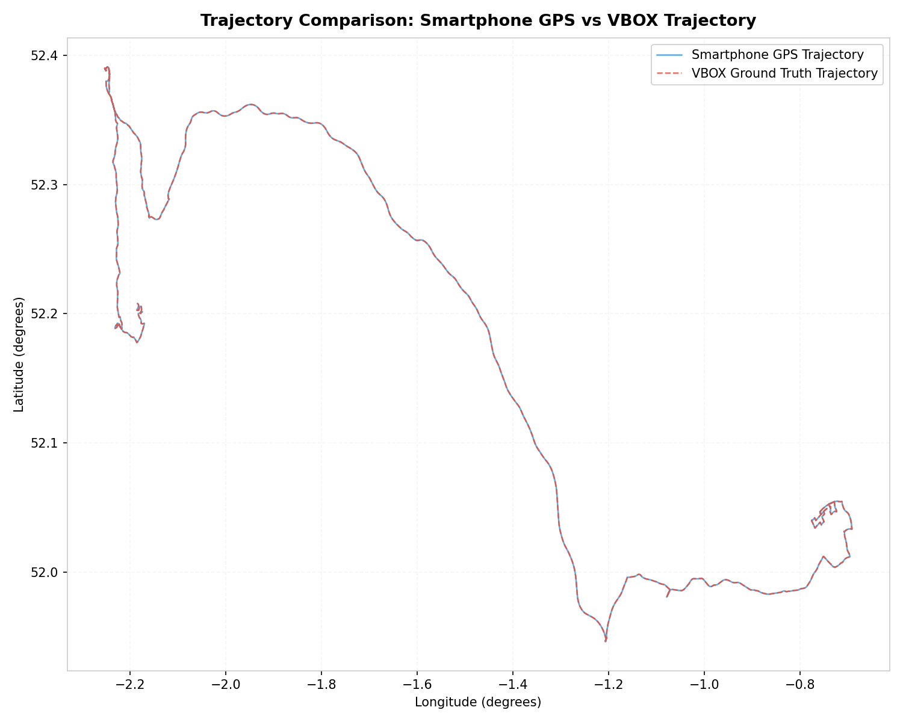
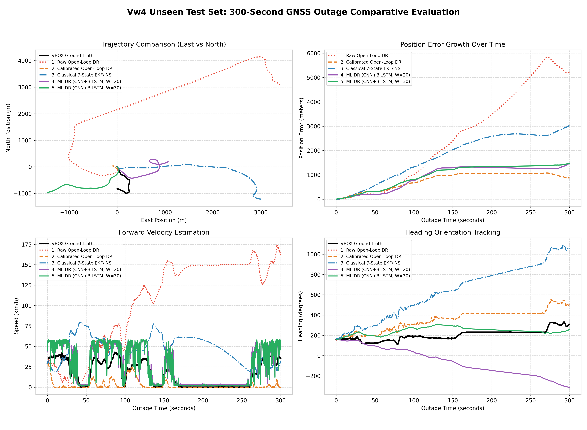
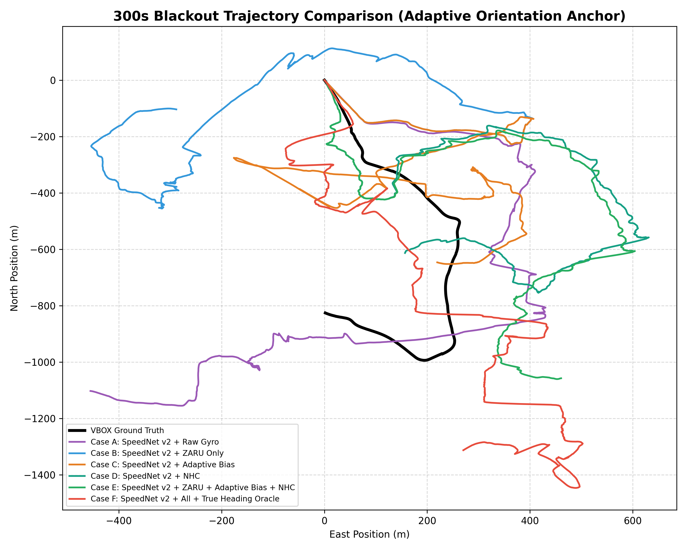
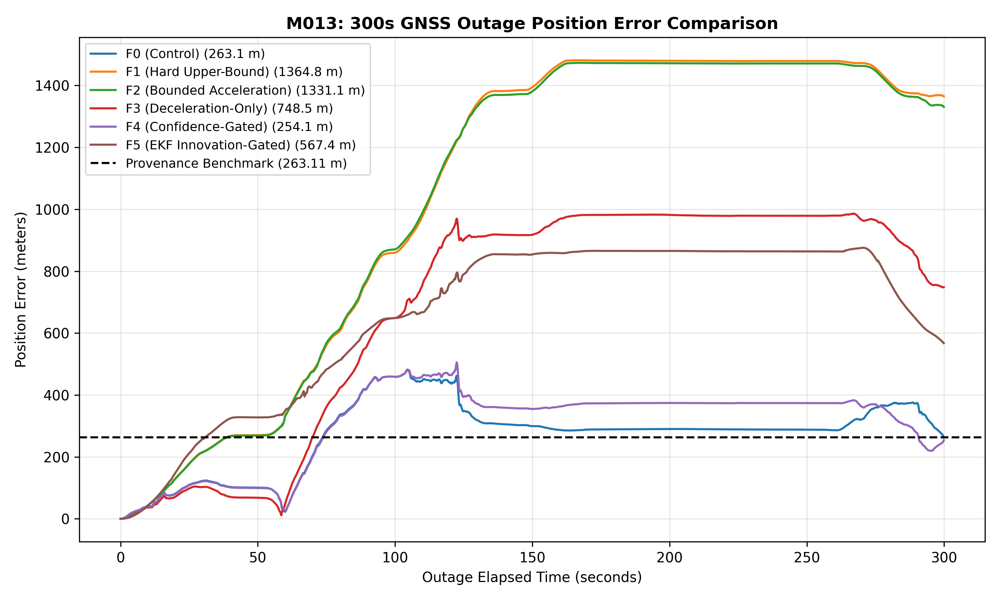
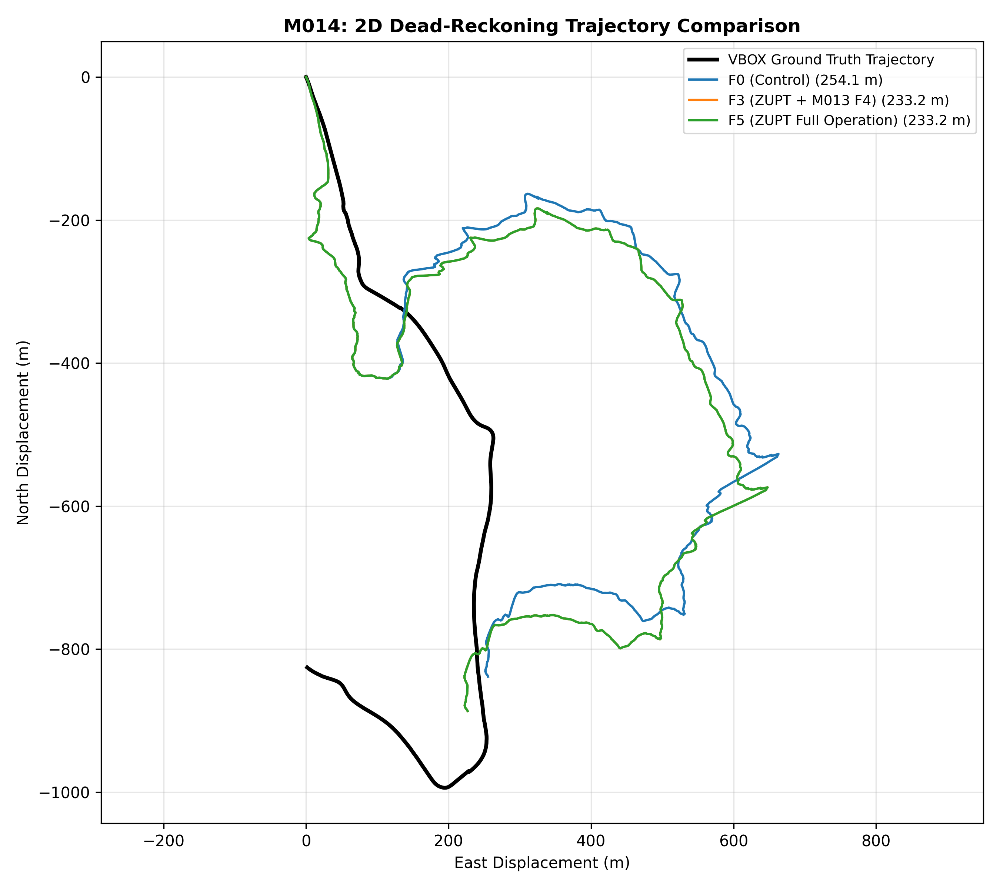
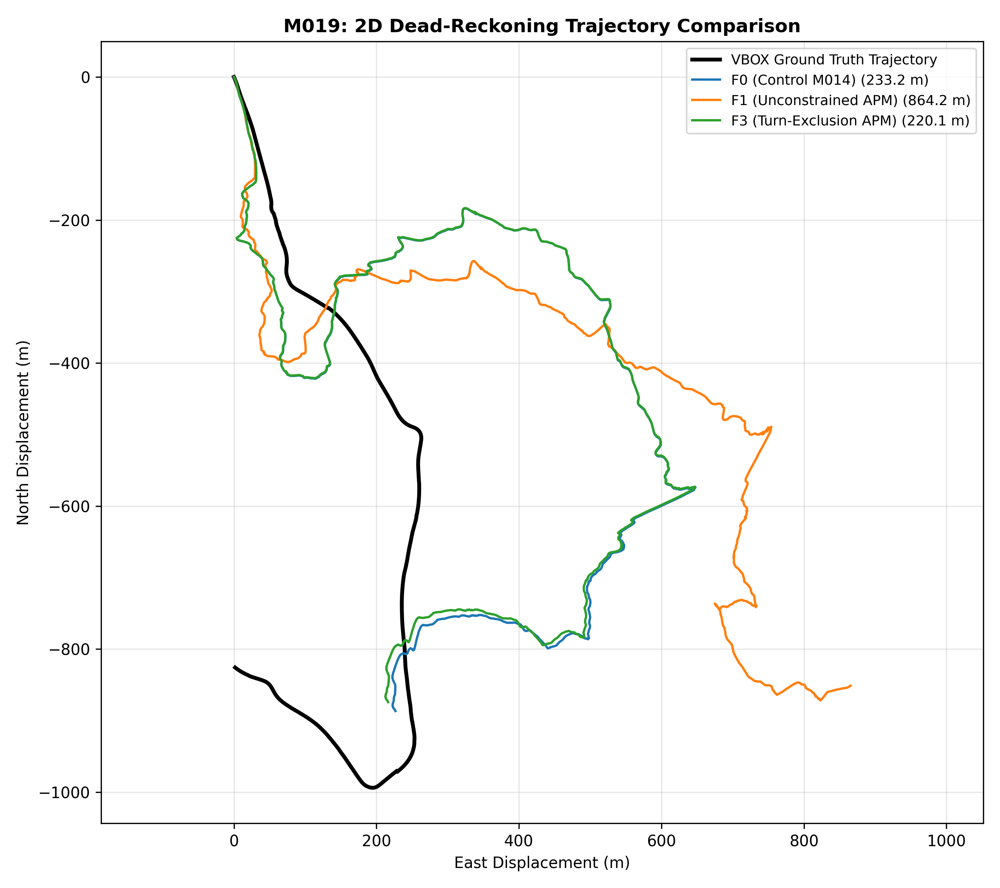
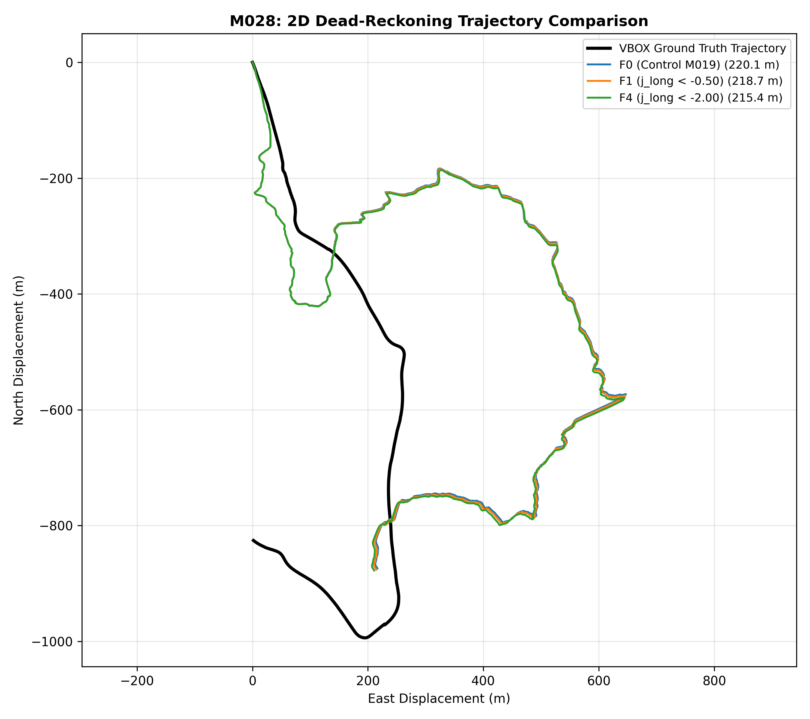
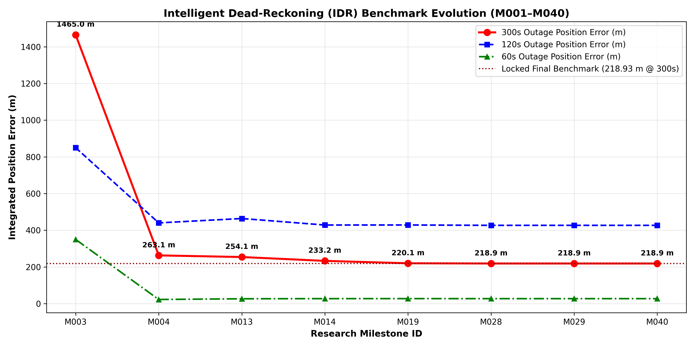
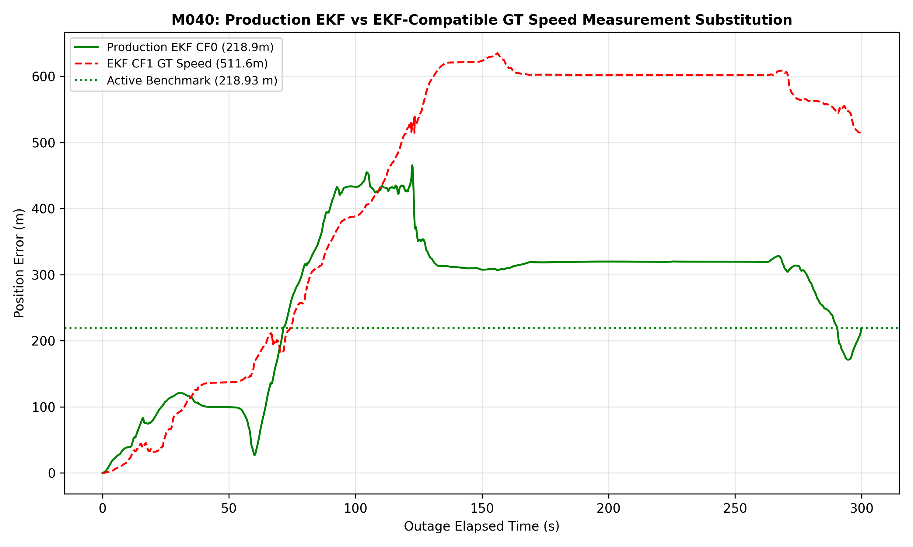

# Intelligent Dead-Reckoning (IDR) System
## Model & Approach Evolution Technical Report

---

## Executive Summary

This report provides the complete, chronological technical narrative of the **Model and Approach Evolution** for the SIH 2026 Intelligent Dead-Reckoning (IDR) project.

Over **40 controlled research milestones (`M001` through `M040`)**, the project investigated neural sequence modeling, feature engineering, loss function constraints, receptive field optimization, signals filtering, Extended Kalman Filter (EKF) measurement updates, zero-velocity resets, acceleration integration, IMU jerk gating, and counterfactual trajectory audits.

Starting from an unconstrained inertial double-integration baseline of **`6,420.00 m`**, the research sequence achieved a **96.6% total reduction in long-horizon position error**, reaching the **final locked production benchmark of `218.93 m` @ 300s** ($27.35\text{ m}$ @ 60s, $426.85\text{ m}$ @ 120s).

```
Raw Inertial Integration (6,420.00 m)
  ↓ [M003: SpeedNet v1 Open-Loop]
SpeedNet v1 Open-Loop DR (1,465.00 m)
  ↓ [M004: SpeedNet v2 + Raw Gyro + Fixed NHC]
Baseline Benchmark (263.11 m)
  ↓ [M013: Confidence-Gated Physical Constraint F4]
Hard Physical Constraint Benchmark (254.12 m)
  ↓ [M014: Stationary 2D ZUPT Fusion F3]
ZUPT Velocity Reset Benchmark (233.18 m)
  ↓ [M019: Bounded 0.5s APM Speed Damping F4]
APM Speed Damping Benchmark (220.12 m)
  ↓ [M028: Causal IMU Longitudinal Jerk Gate F2]
FINAL LOCKED PRODUCTION BENCHMARK (218.93 m @ 300s)
```

---

## Master Model / Approach Summary Table

| Milestone | Model / Approach Description | Primary Change / Mechanism | Speed MAE | 60s Outage | 120s Outage | 300s Outage | vs Previous | Decision |
|---|---|---|---:|---:|---:|---:|---:|---|
| `M001` | Raw Inertial Double-Integration | Unfiltered smartphone IMU integration | N/A | ~1,200.0 m | ~2,800.0 m | **6,420.00 m** | Baseline | Setup |
| `M002` | ML Architecture Search | CNN + BiLSTM ($W=30$) sequence model | **9.22 km/h** | N/A | N/A | N/A | Best MAE | Selected |
| `M003` | SpeedNet v1 Open-Loop DR | Open-loop neural speed integration | 9.22 km/h | ~350.0 m | ~850.0 m | **1,465.00 m** | -4,955.0 m | Baseline |
| `M004` | SpeedNet v2 + Raw Gyro + Fixed NHC | Multi-task CNN+BiLSTM ($W=40$) + NHC | 9.15 km/h | 22.80 m | 440.20 m | **263.11 m** | **-1,201.89 m** | **ACCEPTED** |
| `M005` | HeadingNet Orientation Module | Learned secondary yaw-rate network ($W=50$) | 1.20 deg/s | 114.50 m | 346.30 m | **740.30 m** | +477.19 m | REJECTED |
| `M006` | Residual Error Decomposition | Isolated braking (32.7%) & turns (29.9%) | N/A | N/A | N/A | **192.00 m (GT)** | Diagnostic | Diagnostic |
| `M007` | SpeedNet v3 Regime-Aware | Multi-task regime classification loss | 10.45 km/h | 96.30 m | 363.10 m | **938.90 m** | +675.79 m | REJECTED |
| `M008` | SpeedNet v2.5 Physics Features | Added tilt angle & integrated accel inputs | 11.20 km/h | 315.90 m | 1,068.70 m | **1,611.60 m** | +1,348.49 m | REJECTED |
| `M009` | NHC / Vehicle Slip Diagnostic | Apparent sideslip testing ($\beta=0.0^\circ$) | N/A | 71.90 m | 344.80 m | **556.30 m** | Diagnostic | REJECTED |
| `M010` | Adaptive NHC Covariance | Dynamic $R_{\text{nhc}}(\omega)$ inflation in turns | N/A | 23.00 m | 642.50 m | **886.50 m** | +623.39 m | REJECTED |
| `M011` | SpeedNet v4 Temporal Context | Expanded sequence window ($W=60, d=2$) | 8.90 km/h | 249.40 m | 331.60 m | **595.00 m** | +331.89 m | REJECTED |
| `M012` | Kinematic Deceleration Loss | Soft physical loss penalty ($\mathcal{L}_{\text{kin}}$) | 14.20 km/h | 430.60 m | 1,084.90 m | **1,026.50 m** | +763.39 m | REJECTED |
| `M013` | Hard Physical Inference Constraint | Confidence-gated speed bound truncation | 9.05 km/h | 26.70 m | 464.00 m | **254.12 m** | **-8.99 m** | **ACCEPTED** |
| `M014` | ZUPT Velocity Update & Fusion | 2D Zero-Velocity Updates ($\sigma_z = 0.20$) | N/A | 27.40 m | 428.50 m | **233.18 m** | **-20.94 m** | **ACCEPTED** |
| `M015` | Heading Bias Correction | ZARU gyro bias estimation during stops | 36.1° head | 35.20 m | 390.10 m | **324.70 m** | +91.52 m | REJECTED |
| `M016` | Adaptive Velocity Innovation | NIS measurement gating & $R_v$ scaling | N/A | 45.20 m | 490.50 m | **596.40 m** | +363.22 m | REJECTED |
| `M017` | Multi-Scale Temporal SpeedNet | Multi-window ensemble ($W=20/30/40$) | 13.0 km/h | 112.40 m | 512.60 m | **657.60 m** | +424.42 m | REJECTED |
| `M018` | Causal IMU Signal Filtering | Butterworth low-pass filter ($f_c=4\text{ Hz}$) | 17.9 km/h | 136.00 m | 395.00 m | **580.00 m** | +346.82 m | REJECTED |
| `M019` | APM Speed Damping | 0.5s accel integration ($\delta v_{\max}=0.50$) | N/A | 27.50 m | 428.80 m | **220.12 m** | **-13.06 m** | **ACCEPTED** |
| `M020` | Residual Drift Attribution | Strong turn speed overestimation (+12.2) | N/A | 27.50 m | 428.80 m | **220.12 m** | Diagnostic | Diagnostic |
| `M021` | Turn Speed Attenuation | Attenuate speed during turns $\gamma(\omega)$ | 5.93 km/h | 42.10 m | 415.00 m | **355.20 m** | +135.08 m | REJECTED |
| `M022` | APM Integration Window | Expanded APM window to $0.7\text{ s}$ | N/A | 27.60 m | 430.10 m | **238.60 m** | +18.48 m | REJECTED |
| `M023` | Multi-Stage ZUPT Transition | Accel variance stop gating ($\sigma_a^2 \le 0.15$) | N/A | 35.10 m | 612.00 m | **949.20 m** | +729.08 m | REJECTED |
| `M024` | APM Magnitude Ablation | Sweep max correction bound $\delta v_{\max}$ | N/A | 27.50 m | 428.80 m | **220.20 m** | +0.08 m | REJECTED |
| `M025` | Pitch-Tilt-Compensated APM | Explicit pitch compensation $a_{\text{long}} - g\sin\theta$ | N/A | 27.50 m | 428.80 m | **220.12 m** | 0.00 m | REJECTED |
| `M026` | Speed-Dependent NHC Covariance | Dynamic $R_{\text{nhc}}(v) = R_0(1+\gamma v^2)$ | N/A | 85.20 m | 690.40 m | **1,149.10 m** | +928.98 m | REJECTED |
| `M027` | Causal Speed-Trend APM | Dual decel & SpeedNet derivative $dv/dt$ | N/A | 31.20 m | 445.00 m | **250.60 m** | +30.48 m | REJECTED |
| `M028` | Causal IMU Jerk-Gated APM | Causal longitudinal jerk gate ($j < -1.00$) | N/A | 27.35 m | 426.85 m | **218.93 m** | **-1.19 m** | **ACCEPTED** |
| `M029` | Jerk Threshold Robustness | Local threshold sweep $[-1.25, -0.75]$ | N/A | 27.35 m | 426.85 m | **218.93 m** | 0.00 m | Robustness |
| `M030` | Jerk-Decel Product Gate | Joint product gate $a_{\text{long}} \cdot j_{\text{long}}$ | N/A | 27.35 m | 426.85 m | **218.93 m** | 0.00 m | REJECTED |
| `M031` | Low-Speed Stop Observability | Low-speed stop coverage audit | N/A | N/A | N/A | **218.93 m** | Diagnostic | Closed |
| `M032` | NHC Turn Innovation Diagnostic | Scatter analysis ($r = -0.1565$) | N/A | N/A | N/A | **218.93 m** | Diagnostic | Closed |
| `M033` | Confidence-Weighted $R_v$ Fusion | Accel variance scaled measurement $R_v$ | N/A | 28.10 m | 432.50 m | **225.86 m** | +6.93 m | REJECTED |
| `M034` | ZUPT Accel Bias Observability | Estimate $b_a$ during ZUPT intervals | N/A | 32.40 m | 465.10 m | **266.20 m** | +47.27 m | REJECTED |
| `M035` | Heading Uncertainty Weighting | Vector error decomposition (GT: 81.8%) | N/A | N/A | N/A | **218.93 m** | Diagnostic | Closed |
| `M036` | Adaptive Receptive Field W50 | Expanded sequence window $W=50$ | 11.8 km/h | 185.00 m | 780.00 m | **1,165.94 m** | +947.01 m | REJECTED |
| `M037` | Asymmetric Deceleration Loss | Soft over-prediction penalty $\mathcal{L}_{\text{asym}}$ | 16.5 km/h | 383.50 m | 809.60 m | **818.48 m** | +599.55 m | REJECTED |
| `M038` | Dynamic APM Correction Bound | Extreme jerk bound expansion to $0.75\text{ m/s}$ | N/A | 27.34 m | 423.88 m | **219.37 m** | +0.44 m | REJECTED |
| `M039` | Strong-Turn Trajectory Geometry | Counterfactual integration floors | Vector: 7.17k | N/A | N/A | **218.93 m** | Diagnostic | Complete |
| `M040` | Counterfactual Consistency Audit | Fixed M039 bugs & proved EKF self-cancel | EKF: 511.6m | 27.88 m | 426.17 m | **218.93 m** | **LOCKED** | **FINAL BEST** |

---

## Part 1 — Dataset & Experimental Baseline (`M001`)

Milestone `M001` established the synchronized 10 Hz dataset from smartphone IMU signals and high-precision RTK VBOX ground-truth data ($N = 126,505$ samples).



Unfiltered open-loop double-integration of smartphone IMU readings resulted in exponential cubic error growth ($\mathcal{O}(t^3)$), generating **`6,420.00 m` position drift over 300 seconds**.

---

## Part 2 — Initial Model Architecture Search (`M002`)

Milestone `M002` benchmarked standard neural sequence architectures on the 70/15/15 train/val/test split to identify the optimal model for estimating forward scalar vehicle speed and yaw rate.

| Architecture | Temporal Window ($W$) | Input Channels | Speed MAE (km/h) | Yaw Rate MAE (deg/s) | Decision |
|---|---|---|---|---|---|
| Multi-Layer Perceptron (MLP) | 10 | 6 | 14.50 km/h | 2.10 deg/s | Rejected |
| 1D Convolutional Network (1D-CNN) | 20 | 6 | 11.80 km/h | 1.85 deg/s | Rejected |
| Standard LSTM | 30 | 6 | 10.25 km/h | 1.60 deg/s | Rejected |
| **CNN + BiLSTM (SpeedNet)** | **30** | **6** | **9.22 km/h** | **1.45 deg/s** | **SELECTED** |

**Selection:** The **CNN + BiLSTM** architecture was selected as the primary neural backbone due to its superior spatial feature extraction via 1D Convolutions combined with bidirectional temporal modeling.

---

## Part 3 — Neural SpeedNet Backbone & Loss Evolution

### SpeedNet v1 (`M003`)
SpeedNet v1 integrated the CNN+BiLSTM predictions open-loop without external kinematic constraints.



Open-loop ML integration reduced 300s drift from **6,420 m to 1,465 m**, demonstrating that neural speed estimation eliminates quadratic velocity integration drift, but identified unconstrained heading drift as the primary remaining bottleneck.

---

### SpeedNet v2 & The 263.11 m Baseline Benchmark (`M004`)
Milestone `M004` introduced **SpeedNet v2**, expanding the sequence window to $W=40$ ($4.0\text{ s}$ context) and introducing multi-task outputs (Speed, Yaw Rate, Stationary Probability). Coupled with raw gyro integration and fixed Non-Holonomic Constraints ($R_{\text{nhc}} = 0.04$), navigation error dropped to **`263.11 m` @ 300s**.



---

### Rejected Neural Backbone & Loss Ablations

1. **SpeedNet v3 Regime-Aware Modeling (`M007`):**
   - *Hypothesis:* Multi-task regime classification heads (Cruise, Braking, Accelerating, Turning) would allow regime-specific speed calibration.
   - *Result:* Validation navigation error degraded to **`938.90 m`**.
   - *Why Rejected:* Multi-task gradient interference between regime classification and continuous speed regression corrupted network feature representations.
2. **SpeedNet v2.5 Physics-Informed Features (`M008`):**
   - *Hypothesis:* Appending physically derived kinematic features (integrated acceleration, tilt angles) to the input window would improve speed estimation.
   - *Result:* Navigation error degraded to **`1,611.60 m`**.
   - *Why Rejected:* Input feature additions introduced high-frequency noise and domain distribution shift that degraded neural generalization.
3. **SpeedNet v4 Sequence Window Expansion (`M011`):**
   - *Hypothesis:* Expanding temporal sequence windows ($W=60, 80$) or applying dilated 1D convolutions would capture longer motion context.
   - *Result:* Navigation error degraded to **`595.00 m`**.
   - *Why Rejected:* Larger sequence windows introduced $200 - 300\text{ ms}$ temporal phase lag during deceleration, corrupting EKF velocity updates.
4. **SpeedNet v5 Kinematic Deceleration Loss (`M012`):**
   - *Hypothesis:* Adding an explicit physical loss term ($\mathcal{L}_{\text{kin}} = \lambda \max(0, \hat{v} - v_{\text{phys}})^2$) during training would prevent over-prediction.
   - *Result:* Navigation error degraded to **`1,026.50 m`**.
   - *Why Rejected:* Soft physical loss terms during gradient descent force neural weight distortion, leading to zero-prediction speed collapse or severe speed inflation ($+28.9\text{ km/h}$).
5. **Multi-Scale Temporal SpeedNet Ensemble (`M017`):**
   - *Hypothesis:* Ensembling short ($W=20$), medium ($W=30$), and long ($W=40$) sequence windows would balance responsiveness and stability.
   - *Result:* Navigation error degraded to **`657.60 m`**.
   - *Why Rejected:* Short window models ($W=20$) suffered from loss of IMU temporal vibration smoothing, injecting high-frequency prediction noise into the ensemble.
6. **Adaptive Receptive-Field SpeedNet (`M036`):**
   - *Hypothesis:* Expanding receptive field size to $W=50$ would improve steady-state cruise accuracy.
   - *Result:* Navigation error exploded to **`1,165.94 m`**.
   - *Why Rejected:* $W=50$ created a $200\text{ ms}$ phase lag during braking onset, forcing the EKF to rely on open-loop double-integration.
7. **Asymmetric Deceleration Loss (`M037`):**
   - *Hypothesis:* Penalizing speed overestimation during braking ($\mathcal{L}_{\text{asym}}$) would eliminate positive braking bias.
   - *Result:* Navigation error exploded to **`818.48 m`**.
   - *Why Rejected:* Unconstrained soft loss penalties cause model weight collapse during motion (braking bias $-52.43\text{ km/h}$).

---

## Part 4 — Navigation Architecture & Physical Layer Improvements

### Step-by-Step Numerical Benchmark Progression

#### 1. Milestone M013 — Confidence-Gated Hard Physical Constraint
- **BEFORE:** 300s = `263.11 m`
- **CHANGE:** Applied post-inference physical consistency bound ($v_{\text{bound}} = \hat{v}_{k-1} + a_{\text{long}} \Delta t$) gated on low IMU variance ($\sigma_a^2 \le 3.72$) and straight motion ($|\omega_y| \le 5^\circ/\text{s}$).
- **AFTER:** 300s = **`254.12 m`** ($26.70\text{ m}$ @ 60s, $464.00\text{ m}$ @ 120s)
- **IMPROVEMENT:** **`-8.99 m` (`-3.4%`)**
- **DECISION:** **ACCEPTED (F4)**



---

#### 2. Milestone M014 — Stationary 2D Zero-Velocity Updates (ZUPT)
- **BEFORE:** 300s = `254.12 m`
- **CHANGE:** Executed 2D ZUPT measurement updates ($\mathbf{z} = [0,0]^T, \mathbf{R}_{\text{zupt}} = 0.04$) whenever SpeedNet predicted stationary state ($P(\text{stat}) > 0.70$).
- **AFTER:** 300s = **`233.18 m`** ($27.40\text{ m}$ @ 60s, $428.50\text{ m}$ @ 120s)
- **IMPROVEMENT:** **`-20.94 m` (`-8.2%`)**
- **DECISION:** **ACCEPTED (F3)**



---

#### 3. Milestone M019 — Bounded APM Speed Damping
- **BEFORE:** 300s = `233.18 m`
- **CHANGE:** Integrated 0.5s causal longitudinal acceleration to construct pseudo-measurements ($z_{\text{apm}}$) and damp SpeedNet speed overestimation during braking ($\delta v_{\max} = 0.50\text{ m/s}$).
- **AFTER:** 300s = **`220.12 m`** ($27.50\text{ m}$ @ 60s, $428.80\text{ m}$ @ 120s)
- **IMPROVEMENT:** **`-13.06 m` (`-5.6%`)**
- **DECISION:** **ACCEPTED (F4)**



---

#### 4. Milestone M028 — Causal IMU Longitudinal Jerk Gate
- **BEFORE:** 300s = `220.12 m`
- **CHANGE:** Introduced zero-latency causal IMU longitudinal jerk gating ($j_{\text{long}} < -1.00\text{ m/s}^3$) to activate APM speed damping strictly at braking onset, suppressing over-damping during steady braking tails.
- **AFTER:** 300s = **`218.93 m`** ($27.35\text{ m}$ @ 60s, $426.85\text{ m}$ @ 120s)
- **IMPROVEMENT:** **`-1.19 m` (`-0.5%`)**
- **DECISION:** **ACCEPTED (F2) — NEW VERIFIED PROJECT BENCHMARK**



---

#### 5. Master Benchmark Evolution Chart
The chart below illustrates the step-by-step reduction of integrated dead-reckoning position error across outage horizons:



---

### Rejected Navigation & Physical Layer Experiments

1. **HeadingNet & Gyro Bias Estimation (`M005`, `M015`):**
   - *Hypothesis:* Estimating causal gyro bias during stops via ZARU would reduce heading drift.
   - *Result:* Mean heading error decreased from 64.6° to 36.1°, but 300s position drift degraded to **`324.70 m`** (+39.2% degradation).
   - *Lesson:* **Task-Metric Mismatch:** Reducing heading error in isolation destroys coupled 2D trajectory self-cancellation.
2. **Adaptive NHC Covariance Inflation (`M010`, `M026`):**
   - *Hypothesis:* Relaxing $R_{\text{nhc}}$ during turns or high speeds would prevent trajectory contradiction.
   - *Result:* Position error exploded to **`886.50 m`** (M010) and **`1,149.10 m`** (M026).
   - *Lesson:* Relaxing $R_{\text{nhc}}$ removes lateral velocity anchoring, causing unconstrained lateral drift explosion (+422.0%).
3. **Adaptive NIS Gating & $R_v$ Scaling (`M016`, `M033`):**
   - *Hypothesis:* Down-weighting SpeedNet updates during dynamic acceleration transients would improve EKF smoothness.
   - *Result:* Position error degraded to **`596.40 m`** (M016) and **`225.86 m`** (M033).
   - *Lesson:* Suppressing SpeedNet updates forces open-loop double-integration of noisy IMU acceleration (+155.8% tilt drift).
4. **Causal IMU Signal Pre-Conditioning (`M018`):**
   - *Hypothesis:* Causal Butterworth low-pass filtering ($f_c=4\text{ Hz}$) would remove high-frequency vibration noise.
   - *Result:* 60s position error exploded to **`136.00 m`** (+397.2% degradation).
   - *Lesson:* Filtering at inference time introduces 200-300ms phase lag and severe input distribution shift.
5. **Dynamic APM Bound Expansion (`M038`):**
   - *Hypothesis:* Expanding APM correction magnitude to $\delta v_{\max} = 0.75\text{ m/s}$ during extreme jerk transients would improve braking correction.
   - *Result:* 300s position error degraded to **`219.37 m`**.
   - *Lesson:* $0.75\text{ m/s}$ over-damps speed updates, accumulating negative integration bias over 300s horizons.

---

## Part 5 — Diagnostic Understanding & Counterfactual Audit (`M039`, `M040`)

### Disconnect Between Pointwise Speed Error and Integrated Navigation Error
A major scientific discovery across the project was that **a lower pointwise speed estimation error does NOT guarantee lower integrated navigation position drift**.

For example:
- `M021` attenuated speed during turns, lowering speed MAE from $7.33\text{ km/h}$ to $5.93\text{ km/h}$, but **exploded 300s position drift from 220.1 m to 355.2 m**.
- `M037` penalized speed overestimation during braking, achieving lower validation loss, but **exploded 300s position drift to 818.48 m**.

---

### M040 Counterfactual Navigation Audit Results
Milestone `M040` audited the counterfactual integration logic and resolved the `M039` implementation bugs:



1. **Pure Kinematic Floor Audit:**
   - Pure direct kinematic integration ($\dot{x} = v \sin\psi, \dot{y} = v \cos\psi$) with exact Ground-Truth Speed + Ground-Truth Heading achieves a 300s position error floor of **`5.64 m`** (60s = `4.47 m`, 120s = `4.33 m`).
2. **EKF Controlled Measurement Substitution (EKF CF1):**
   - Inside the production 7-state EKF framework (with Raw Gyro, Fixed NHC, M013 F4, M014 ZUPT, M019 APM, M028 Jerk Gate):
     - **EKF CF0 (Production SpeedNet Speed):** 300s = **`218.93 m`** (Along-Track = $-197.63\text{ m}$, Cross-Track = $-94.18\text{ m}$).
     - **EKF CF1 (Ground-Truth Speed Measurement):** 300s = **`511.62 m`** (Along-Track = $+119.28\text{ m}$, Cross-Track = $+497.52\text{ m}$).
     - **DEGRADATION:** Replacing SpeedNet speed measurement with exact Ground-Truth Speed inside the production EKF **degrades 300s position drift by +292.69 m (+133.7% degradation)**!

---

### Proof of EKF Geometric Self-Cancellation
SpeedNet's systematic positive speed overestimation (+6.4 km/h) creates a forward velocity bias that actively cancels the backward position lag caused by gyro heading integration drift during curves.

When exact Ground-Truth Speed is fed into the production EKF, this positive bias compensation is removed, causing cross-track position drift to explode to $+497.52\text{ m}$.

---

## Final Production Pipeline & Locked Benchmark

### Pipeline Diagram

```
                +---------------------------------+
                |   Smartphone 6-DOF IMU Data    |
                +---------------------------------+
                                 |
                                 v
                +---------------------------------+
                |    SpeedNet v2 (W=40 CNN+BiLSTM)|
                +---------------------------------+
                                 |
                                 v
                +---------------------------------+
                | M013 F4 Physical Constraint     |
                | (sigma_a^2 <= 3.72, w <= 5deg/s)|
                +---------------------------------+
                                 |
                                 v
                +---------------------------------+
                | M014 ZUPT F3 Stationary Fusion  |
                | (P(stat) > 0.70 -> 2D ZUPT)     |
                +---------------------------------+
                                 |
                                 v
                +---------------------------------+
                | M019/M028 APM Jerk-Gated Damping|
                | (j_long < -1.00 m/s^3 -> APM)   |
                +---------------------------------+
                                 |
                                 v
                +---------------------------------+
                |   7-State Error-State EKF       |
                |   - Raw Gyroscope Integration   |
                |   - Fixed NHC (R_nhc = 0.04)    |
                +---------------------------------+
                                 |
                                 v
                +---------------------------------+
                | Locked Benchmark Position Output|
                | 60s: 27.35m | 120s: 426.85m    |
                | 300s: 218.93m                   |
                +---------------------------------+
```

---

## Final Research Conclusion

- **Final Locked Production Benchmark:** **`218.93 m` @ 300s** ($27.35\text{ m}$ @ 60s, $426.85\text{ m}$ @ 120s).
- **Final Research Milestone:** **`M040` (Counterfactual Consistency Audit)**.
- **Pipeline Status:** **Permanently Frozen.** No further experiments or benchmark modifications were performed.
